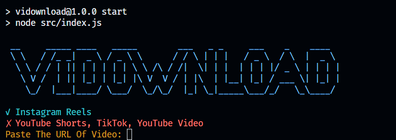

# VIDOWNLOAD



vidownload js is a Node.js based CLI application designed to make it easier for users to download videos from Instagram Reels. This application uses technologies such as Puppeteer to control the browser and Axios to make HTTP requests to the Instagram server.

## Main feature

- **Simple Use**: Just enter the URL of an Instagram Reels video, and the app will download it automatically.
- **CLI Interface**: Built using readline for an interactive command line interface.
- **Puppeteer for Automation**: Use Puppeteer to access and control Instagram web pages.
- **Axios for HTTP Requests**: Leverages Axios to download videos from a given URL.

## Installation

1. Clone the repository:

   ```bash
   git clone https://github.com/RizkyZaki/vidownload.git
   cd vidownload
   ```

2. Install the required dependencies:

   ```bash
   npm i
   ```

## Usage

Run the main script:

```bash
npm start
```

## Use

After running the app with `npm start`, the app will ask you to enter the Instagram Reels video URL. Once the URL is entered, the application will start downloading the video and save it in the `output` folder with the name `result.mp4`.

## Contribution

Contributions and suggestions are highly appreciated. If you would like to contribute to this project, please open an _issue_ or submit a _pull request_.

## Licence

Distribute under the MIT license. For more information, see `LICENSE`.

---

© 2024 zch. Built with love for the developer community.
